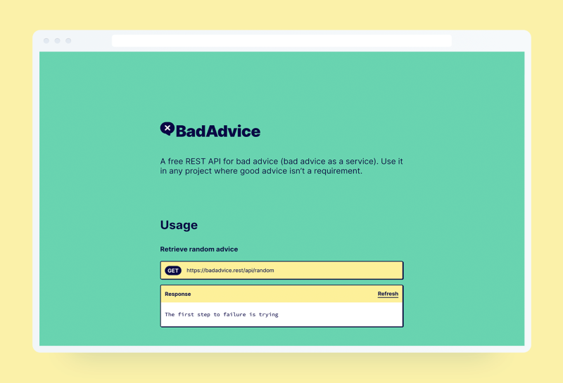
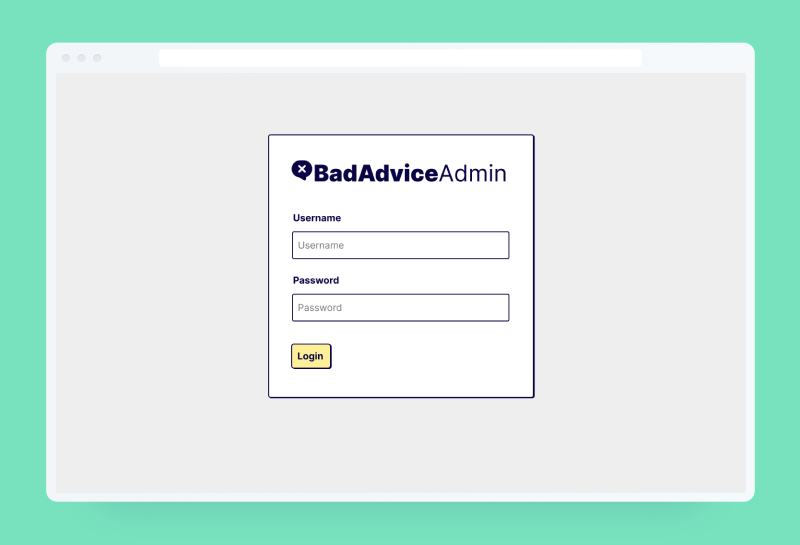
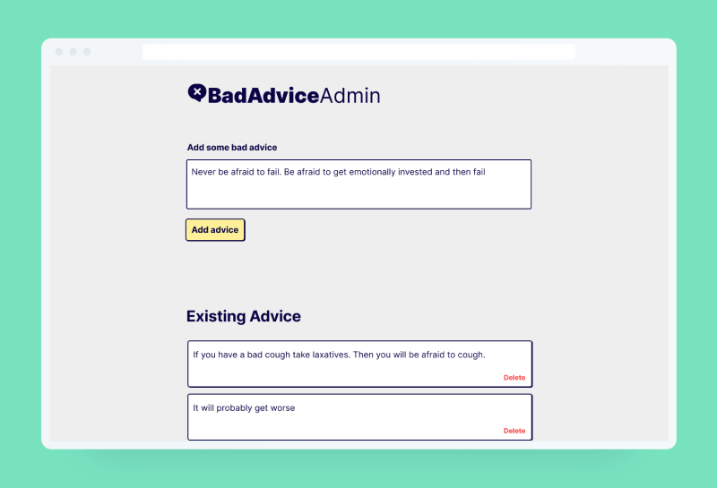

# BadAdvice

In my previous project, [Shibagram](/shibagram), I took advantage of a public API to build an instagram alternative for Shiba Inu lovers. After this I couldn't help but wonder if I could make my own public API.

Halfway through completing the [Full Stack open course](https://fullstackopen.com/en/) I wanted to test what I learned about backend technologies. Enter [BadAdvice](https://badadvice.rest/), a public API that provides bad advice. With this project I got the chance to explore node/express to create the API and mongoDB for the database. I also created authentication from scratch for an admin area where you can add or remove entries to the API.

