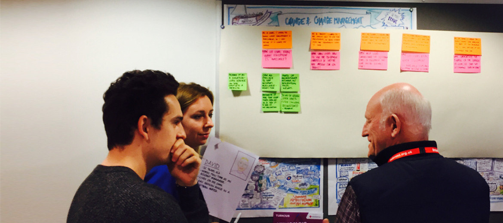
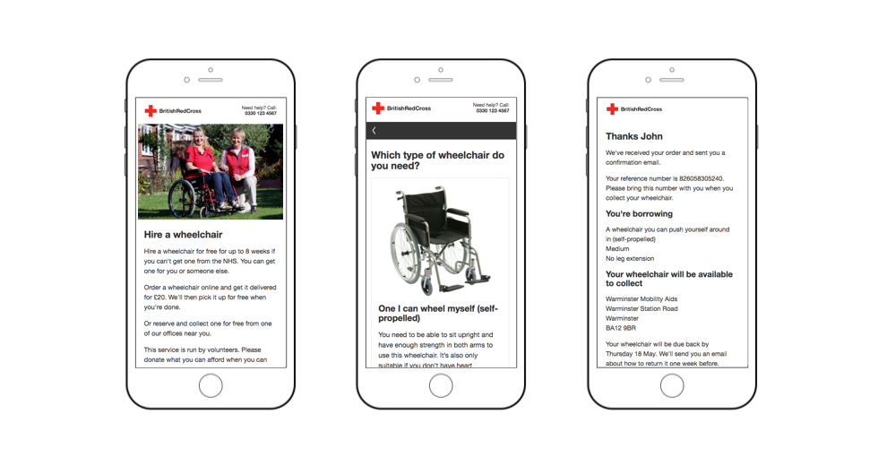
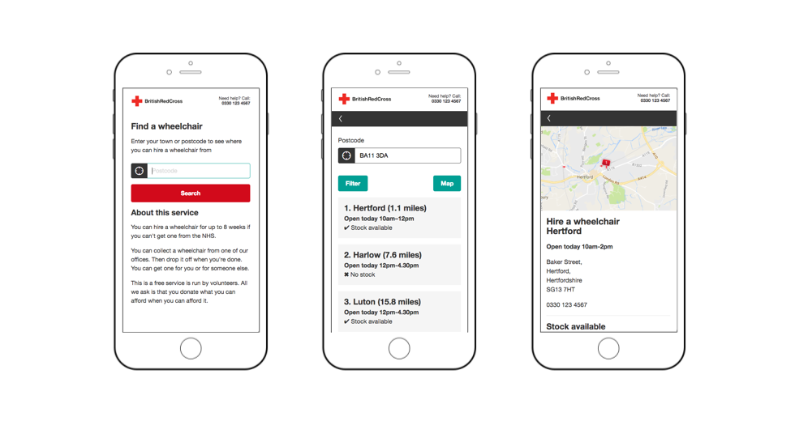
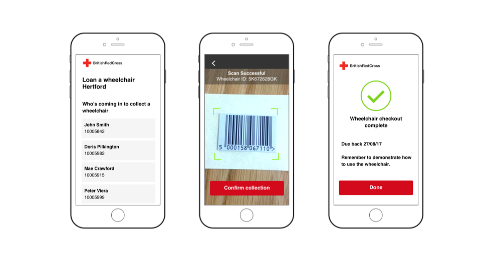
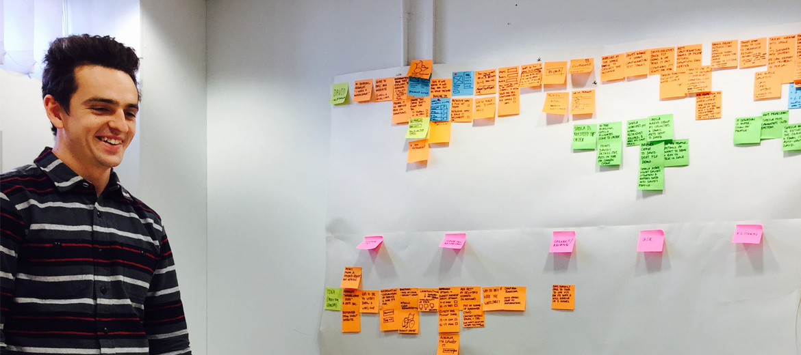

# Borrow a wheelchair

The British Red Cross Mobility Aids is a volunteer run, donation based service providing short-term wheelchair loans for over 100 years. Unfortunately the NHS doesn’t give wheelchairs for patients that need one for less than six months. The Red Cross helps fill this gap by providing ⅔ of all short-term wheelchair loans in the UK.

## The challenge

Up until recently, Mobility Aids had been operating the same way for the past 50 years. The service undertook a transformation with the main goal of increasing its user reach. This involved exploring new ideas including home delivery, online ordering and live inventory systems.

<iframe class="video" width="560" height="315" src="https://www.youtube.com/embed/V-eDeQl9yX4" frameborder="0" allow="accelerometer; autoplay; encrypted-media; gyroscope; picture-in-picture" allowfullscreen></iframe>

## My role

I was a UX designer on the project responsible for conducting user research, prototyping and testing new ideas.

## Discovery

In the discovery phase our aim was to find out who the service users are and how well their needs are met. Over 4 weeks our team interviewed users and staff, ran workshops, reviewed analytics, mapped out the existing service and created a prototype. This provided us with key insights that informed what we’d do in alpha:

### Users don’t know they can get a wheelchair, unless they speak to the Red Cross

Users needed to ring up to find out if, how and when they could get a wheelchair. This can be a problem as centres are generally open for a handful of hours a week.

> "My husband got out of hospital on Friday. I tried calling but you were closed."   - Service user

### Users keep a wheelchair longer than they need it

Users would often forget or put off returning a wheelchair. This could prevent someone else from getting one in peak season.

> "I only needed the wheelchair for the weekend but kept it for a month."   - Service user

### Users don’t know how much to donate

Users are unsure how long they’ll need the wheelchair and prefer to donate when returning it.

> "I’ll give more after I know how long I need it for."   - Service user

### Improving service awareness requires more research

Many patients discharged from hospitals didn’t know they could get a wheelchair from the Red Cross. We found awareness of the service within the hospital system was a complex problem warranting its own discovery.

### Doubts about delivery

Towards the end of discovery, our team beginning to have doubts about the shift towards delivering wheelchairs as most users preferred to collect a wheelchair. In Alpha, we would need to delve deeper to establish whether a move towards delivery would support user need.

### Teaming up with the online ordering project

By showing wheelchair availability online, users would know when and how they could get one. It made sense from this point on to team up with the online ordering project in alpha.

## Alpha

Our goal was to explore ways users could order a wheelchair online and what tech/processes would be needed to support it. We created three prototypes:

### Prototype 1: Borrow and return a wheelchair

This HTML prototype allowed users to borrow a wheelchair online. It helped us answer questions around demand for delivery, asking for donation and user confidence in selecting the correct wheelchair.

### Prototype 2: When and where users can get a wheelchair

We tested this HTML prototype to find out if it would be enough to only show users stock availability. We discovered users felt more confident in getting a wheelchair when reserving one online.

### Prototype 3: Wheelchair checkout for volunteers

This Invision prototype allows a volunteer to confirm a user has collected a wheelchair. This was our first attempt at designing an alternative to the default inventory system interface the volunteers have to use. Some volunteers were nervous to try it out but all could complete the checkout processes quickly and unaided.

### More users chose to collect a wheelchair

We ran several rounds of usability and online click tests with prototypes in a variety of scenarios. In all the tests users chose to collect a wheelchair rather than get it delivered.

> "I’d collect it to save money on the delivery cost and so I can see the wheelchair."   - Service user

### Users could complete the process online but some preferred to do it offline

During testing, some users preferred to get in touch with the service if they were unsure of something. We learnt that this is something we’ll need to accommodate for in beta.

> "I’d call up at this point. I prefer to speak to someone because it makes me feel more comfortable."   - Service user

### Moving away from a delivery model

By the end of alpha, we had substantial evidence that the proposed wheelchair delivery model was not going to support user need. So for beta we would be focusing on making it easier for users to collect a wheelchair. There was however still the unanswered question of how to get wheelchairs to those who can’t get to a mobility aids centre, which needs further exploration.

## Moving to beta

The aim for beta will be to build an end-to-end version of the service so we can further learn from users in a live environment. By limiting the amount of transactions, we can make changes to the service where needed before trying to scale nationwide.

