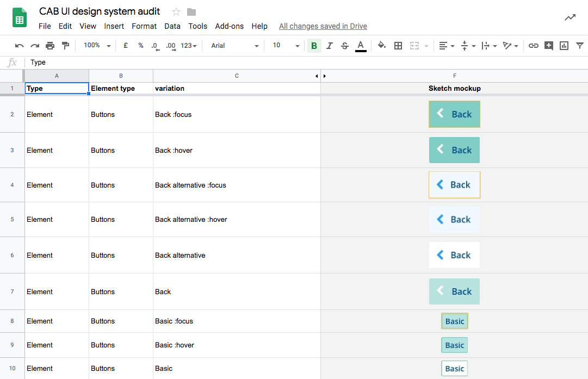
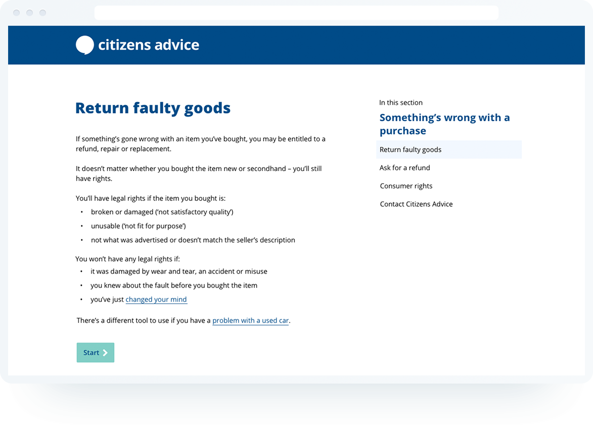
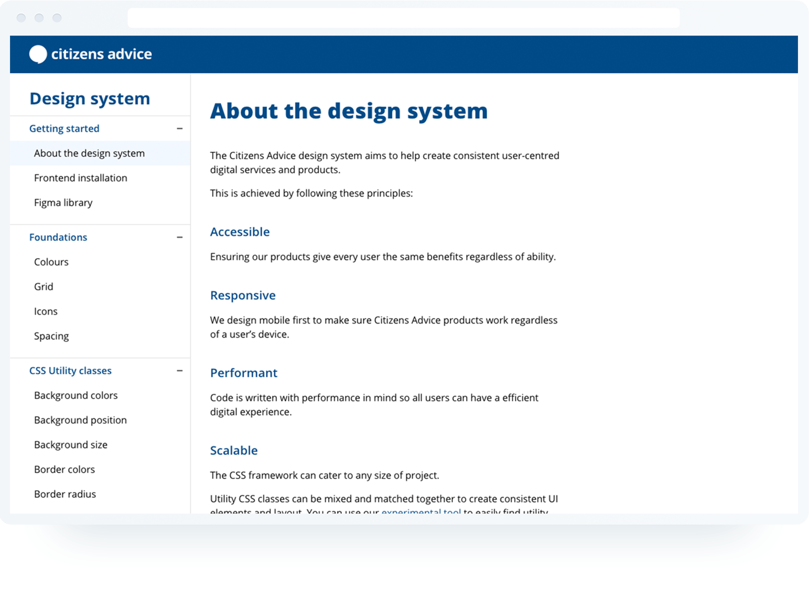
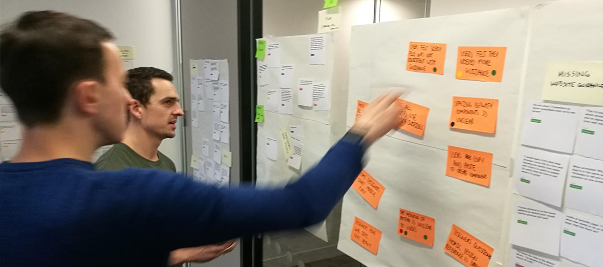

# Citizens Advice design system

Citizens Advice is a not-for-profit that helps millions of people across the UK by providing advice on a range of issues including benefits, employment and housing. The public [website](https://www.citizensadvice.org.uk/) provides free advice and receives over 25 million visits per year. To accommodate for the future growth of the Citizens Advice digital presence we built a design system.

A design system contains elements that allow organisations to design and build digital products. Using a design system can speed up design and development whilst creating creating consistency for users.

## The challenge

The current component library, CAB UI, was designed with one case in mind, the website. Without clear documentation and governance the library became bloated and difficult to scale.

We wanted to replace CAB UI with a design system that creates consistency in design and development across all digital products. These digital products should be performant and accessible for all user types.

## My role

I led the project team which was made up of 3 designers and 2 developers. I contributed to both the design and front-end development of the system.

## Audit on existing UI and development

Before creating the system we wanted to understand the ways the existing UI library and Front-end code could be improved.

We catalogued and compared all UI elements on the public website. Most of the UI elements were designed in a consistent manner but how they were used widely varied. We also noted how usability and accessibility could be improved in some of the components.

We reviewed the front-end code on the public website and found a variety of unique font sizes, colours, media queries and spacing used. Multiple CSS classes were doing the same thing which led to an unnecessarily bloated codebase.

## Establishing our foundations

To create consistency across the system we wanted to make design decisions on the lowest level possible. We called these low level decisions, foundations and they include spacing, colours and typography.

We tested these foundations by using them in various UI components and layouts with current products to ensure they were appropriate.

## Creating components

With the redesign of an online form coming up, we saw this as an opportunity to embed the design system. We looked at what UI components would be needed and redesigned them using our new spacing, colours and typography values. Once we were happy with the results we created them in code with a matching component library in Sketch.

To ensure our components were accessible, we put them in to a HTML prototype and tested it with screen reader and accessibility auditing tools.

## Documenting the system

With our intended audience being designers and developers, we declared our assumptions on what they would need from the design system.

We then built a static documentation site that featured examples of components, corresponding code snippets and guidance. To understand if the documentation was useful, we tested it with both internal and external designers and developers.

## Testing the system with developers

Developers were tasked with building a HTML prototype based on some high-fidelity mockups. We wanted to find out if the documentation was helpful enough for them to create a consistent and accessible prototype easily. Here are some of the key findings:

### Developers succesfully installed dev environment & built the prototype

All the developers successfully installed the framework and put together a working prototype within the time allowed.

### Some developers expected to find specific documentation more easily

Some developers could not find the component information they wanted. This lead me to redesign the navigation bar on the documentation site to make components easier to find. When the design system grows, search may need to be considered.

### Some developers expected more accessibility guidance

Some developers required more information guidance to ensure the components they were using were accessible. We then highlighted gaps in the documentation and how we could present them.

## Testing the system with designers

Designers were tasked with creating some high-fidelity mock ups based on some low-fidelity wireframes. We wanted to find out how they’d use the components and if they’d layout out the UI in a consistent manner. Here are some of the key findings:

### Designers thought the meaning of ‘patterns’ was unclear

We originally had all the parts of the design system sorted into foundations, components and patterns. Patterns were groupings of components. Designers were often confused between what a component and what a pattern was. We decided to merge the two as our users perceived them to be the same thing.

### Most designers ignored the documentation site and only used the Sketch file

They used the documentation site to download the sketch file but once they opened the file they didn’t return to the site. Some designers said they needed more guidance. This prompted a discussion to include documentation and examples in the sketch file.

## Adding utility classes to the CSS framework

When prototyping with the design system, I had to add extra CSS classes to create a component variation or when laying out an interface. This meant over time on a large project like the public website, classes would be continuously added which would reduce the performance of the website.

Through personal projects, I experimented with utility classes and found them much more flexible for design and development. So I started looking at how bigger organisations were using them to create more scalable design system.

Utility classes are CSS classes that are meant to do only one thing and when combined can build any component or layout. They allow developers to create components that embrace the foundations (colour, spacing, typography) and makes is easy to extend existing components. I demonstrated the benefits utility classes to the rest of the team by showing how existing components could be easily marked up and modified.

Over the New Year break I worked with the developers to refactor framework to include utility classes. These were put together in a modular way, so developers can bring in only what they need.

## What’s next

The design system has now been adopted by multiple projects and will soon be adopted on the Citizens Advice website redesign. Seeing how the design system is used by multiple teams has highlighted some areas for improvement:

### Facilitating the creation of components

The components that are currently in the design system were our MVP. Some teams have been building components which could be used in other projects. I’d like to figure out how all designers and developers can contribute into the system.

### Supporting React

Citizens Advice uses React for some of its web apps and there’s opportunity for the design system to create a reusable React library to speed up development.

