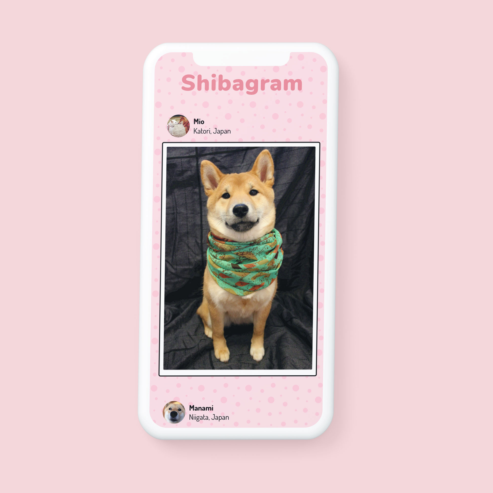

# Shibagram

This project started as a way to test my skills I learned during the Ajax + APIs SuperHi course. I wanted to practice querying an api, and rendering the results from the response. When browsing a list of public APIs I found the shibe.online api for Shiba Inu photos. So I created [Shibagram](https://shibagram.herokuapp.com/), an Instagram alternative for Shiba-Inu lovers. I wanted to go framework-less for this project so I just used good old vanilla Javascipt.

## Development update

This project was depending on [Cors anywhere](https://cors-anywhere.herokuapp.com/corsdemo) which for valid reasons requires users to temporarily unlock the service to use it. So to keep the project alive, I have created a backend that makes requests to the photo API whilst providing a posts API for the frontend to consume. You can check out the repo [here](https://github.com/adamgparsons/shibagram).

